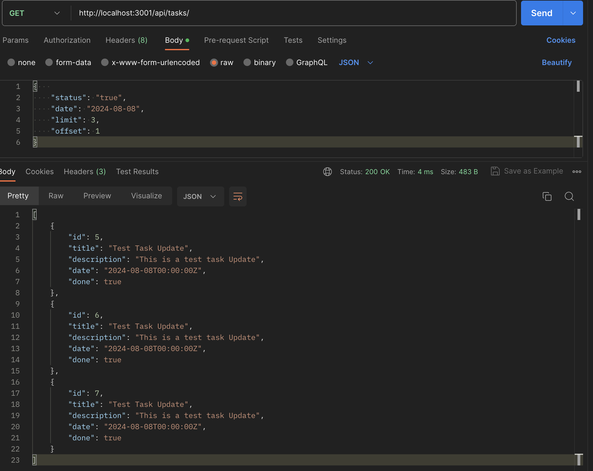

  README для Todo List API

Todo List API
=============

Это простое API для приложения Todo List для создания задач на день.

Функции API
-----------

API предоставляет следующие функции:

*   Создание задачи с полями:
    *   Заголовок
    *   Описание
    *   Дата, на которую заводится задача
    *   Статус выполнено/не выполнено
*   Операции CRUDL для задач
*   Пагинация для списков со статусом "Выполнено" или "Не выполнено"
*   Возможность выдачи задач по дате со статусом "Выполнено" или "Не выполнено"
*   Документация Swagger

Предварительные требования
--------------------------

*   Docker
*   Docker Compose

Начало работы
-------------

Следуйте этим инструкциям, чтобы запустить приложение:

### 1\. Клонируйте репозиторий

    git clone git@github.com:FattakhovRamil/TODO_API_Golang.git
    cd todo_list

### 2\. Постройте и запустите приложение с помощью Docker Compose

    docker-compose up --build

### 3\. Доступ к приложению находиться по адресу:

*   Документация API (Swagger UI): [http://localhost:3001/swagger/](http://localhost:3001/swagger/)

API Эндпоинты
-------------

Вот некоторые примеры API используя Postman:

### GET /api/task/{id} - Получить список задач.

### POST /api/create Создать новую задачу.

### DELETE /api/delete/{id} Удалить задачу по ID.

### PUT /api/tasks/

Обновить задачу по ID.

### GET /api/tasks/ Вывод данных по фильтру 

  

Запуск тестов
-------------

Чтобы запустить тесты внутри контейнера, используйте следующую команду:

    docker exec -it todo_list-todo_list-1 sh
    sh run_tests.sh 
    cat tests/test_results.txt 

База данных
-----------

Приложение использует PostgreSQL в качестве базы данных.

